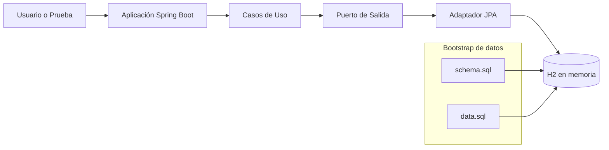

# ADR-002: Persistencia con H2 en memoria y Spring Data JPA

## Estado
Aceptado

## Fecha
2026-05-15

## Contexto
Se necesita una base de datos relacional simple para desarrollo y demostración académica, con configuración rápida y sin dependencias externas complejas.

Adicionalmente, el proyecto prioriza:
- ciclos de prueba cortos,
- facilidad de ejecución en distintos equipos,
- y bajo costo de operación para laboratorio académico.

## Problema Arquitectónico
Si la persistencia depende desde el inicio de un motor externo administrado:
- aumenta la fricción de instalación para el equipo,
- se dificulta la reproducibilidad del entorno,
- y se retrasa la validación de casos de uso del núcleo.

## Decisión
Se utiliza H2 en memoria como motor de base de datos y Spring Data JPA para acceso a datos.

La capa de persistencia se implementa mediante repositorios Spring Data JPA y entidades mapeadas, manteniendo al núcleo de negocio desacoplado de detalles específicos del motor.

## Drivers Arquitectónicos (priorizados)
1. Rapidez de puesta en marcha del entorno
2. Reproducibilidad en contexto académico
3. Bajo acoplamiento entre dominio y tecnología de persistencia
4. Capacidad de evolucionar a motor externo en una fase posterior

## Alternativas Consideradas
1. MySQL/PostgreSQL con servidor externo
2. H2 en memoria con Spring Data JPA - ELEGIDA

## Consecuencias
### Positivas
- Configuración y arranque rápidos.
- No requiere instalación ni administración de un servidor de base de datos.
- Integración natural con Spring Boot y scripts SQL del proyecto.
- Facilita pruebas funcionales locales y demostraciones en aula.
- Permite iterar sobre el modelo de datos sin costos operativos altos.

### Negativas
- Menor realismo frente a un entorno productivo.
- Posibles diferencias de comportamiento al migrar a otro motor relacional.
- Los datos no persisten entre ejecuciones al ser en memoria.

## Decisiones Derivadas
1. Mantener scripts de esquema y datos iniciales versionados para garantizar arranque determinístico.
2. Evitar SQL dependiente de proveedor cuando sea posible.
3. Encapsular acceso a datos en adaptadores de salida para facilitar migración futura.

## Riesgos Detectados y Mitigación
Riesgo 1: Diferencias de SQL y tipos de datos al migrar a PostgreSQL/MySQL.  
Mitigación: priorizar JPQL y SQL estándar; incorporar pruebas de repositorio sobre motor externo en etapas posteriores.

Riesgo 2: Pérdida de información entre ejecuciones.  
Mitigación: poblar datos iniciales mediante scripts y mantener casos de prueba reproducibles.

Riesgo 3: Falsa sensación de rendimiento en entorno local.  
Mitigación: documentar que resultados de H2 no representan métricas productivas.

## Criterios de Cumplimiento del ADR
- La aplicación arranca sin dependencias de base de datos externas.
- El esquema y datos iniciales se cargan automáticamente.
- Los casos de uso acceden a persistencia a través de puertos/adaptadores, no acceso directo al motor.
- El cambio a otro motor relacional requiere cambios mínimos fuera de infraestructura.

## Implicaciones a Futuro
- Se podrá migrar a PostgreSQL/MySQL modificando configuración e implementación de infraestructura sin reescribir reglas de negocio.
- Se recomienda incluir perfil de ejecución alternativo con motor externo para pruebas de integración más realistas.

## Gráfico de Decisión de Persistencia

